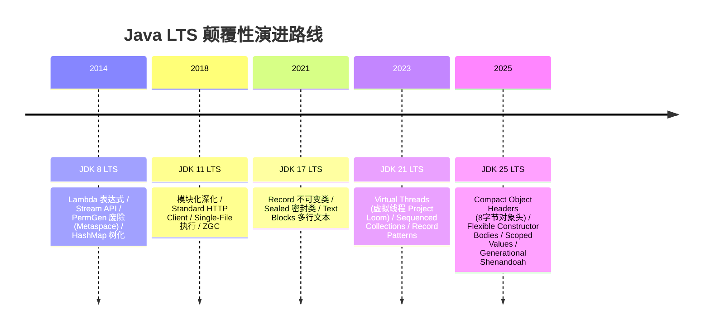

# ☕ Java LTS 官方 Release Notes 深度拆解大典

Java 语言自 1995 年诞生以来，经历了从早期的 JDK 1.0 到现代化 JDK 25 LTS 的跨时代演进。特别是自 Oracle 调整版本发布节奏（每 2-3 年发布一个 LTS 长期支持版本）后，**JDK 8、JDK 11、JDK 17、JDK 21、JDK 25** 成为工业级生产环境中最关键的核心基石。

---

## 🌟 Java LTS 核心版本演进图谱

---

## 📚 快速导航大典

<a href="./jdk-8" style="text-decoration: none;">
  

    <h3 style="margin: 0 0 8px 0; color: #fbbf24;">☕ JDK 8 LTS 深度大典</h3>
    
拆解 JEP 126 (Lambda), JEP 107 (Stream), JEP 122 (Metaspace), JEP 180 (HashMap 红黑树树化)。

  

</a>

<a href="./jdk-11" style="text-decoration: none;">
  

    <h3 style="margin: 0 0 8px 0; color: #38bdf8;">☕ JDK 11 LTS 深度大典</h3>
    
拆解 JEP 323 (var in Lambda), JEP 321 (HTTP Client), JEP 330 (Single-File), JEP 333 (ZGC)。

  

</a>

<a href="./jdk-17" style="text-decoration: none;">
  

    <h3 style="margin: 0 0 8px 0; color: #c084fc;">☕ JDK 17 LTS 深度大典</h3>
    
拆解 JEP 395 (Records), JEP 409 (Sealed Classes), JEP 378 (Text Blocks), JEP 394 (Pattern Matching)。

  

</a>

<a href="./jdk-21" style="text-decoration: none;">
  

    <h3 style="margin: 0 0 8px 0; color: #4ade80;">☕ JDK 21 LTS 深度大典</h3>
    
拆解 JEP 444 (Virtual Threads), JEP 431 (Sequenced Collections), JEP 440 (Record Patterns), JEP 439 (Generational ZGC)。

  

</a>

<a href="./jdk-25" style="text-decoration: none;">
  

    <h3 style="margin: 0 0 8px 0; color: #f472b6;">☕ JDK 25 LTS 深度大典</h3>
    
拆解 JEP 512 (Instance Main), JEP 513 (Flexible Constructor), JEP 506 (Scoped Values), JEP 519 (Compact Headers), JEP 521 (Generational Shenandoah)。

  

</a>

