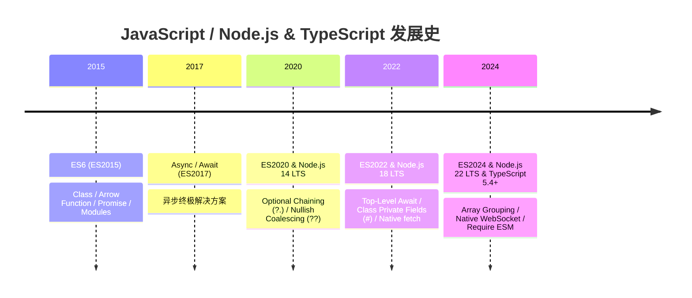

# 🟨 JavaScript / Node.js & TypeScript 进化大典

JavaScript 是构建互联网基础设施与现代全栈应用的无冕之王。从 ES6 (ES2015) 颠覆性的模块化与异步语法，到 Node.js LTS 运行时的服务器端革命，再到 TypeScript 5.x 为全栈开发提供的强类型保障，前栈与后栈正在走向全面的技术统合。

---

## 🌟 语言演进核心技术路线

---

## 🔄 Node.js LTS 版本与 ECMAScript 语法 & V8 引擎对应关系矩阵

| Node.js LTS 版本 | 代号 | 内置 V8 引擎版本 | 支持的最高 ES 规范 | 标志性语法/ API 原生支持矩阵 |
| :--- | :--- | :--- | :--- | :--- |
| **Node.js 18 LTS** | Hydrogen | V8 10.2 | **ES2022** | 全局 `fetch`, Web Streams, Class 私有域 (`#field`), Top-Level Await, `Array.at()`, `Object.hasOwn()` |
| **Node.js 20 LTS** | Iron | V8 11.3 | **ES2023** | 不可变数组方法 (`toSorted()`, `toReversed()`, `with()`), 权限模型 (`--experimental-permission`), 原生测试运行器 (`node:test`) |
| **Node.js 22 LTS** | Jod | V8 12.4 (Maglev JIT) | **ES2024** | 原生 `Object.groupBy()`, `Promise.withResolvers()`, 原生 WebSocket 客户端, `require()` 加载 ESM (`--experimental-require-module`) |

> **提示**: 在服务端 Node.js 项目开发中，建议匹配对应 LTS 版本的最高语法标准，或在 `tsconfig.json` 的 `target` 中填入匹配的 ECMAScript 版本（如 Node 20 设为 `ES2023`）。

---

## 📚 快速导航大典

<a href="./es6" style="text-decoration: none;">
  

    <h3 style="margin: 0 0 8px 0; color: #facc15;">⚡ ES6 (ES2015) 奠基革命</h3>
    
包含 Arrow Functions, Promise, Class, 块级作用域与模块化标准。

  

</a>

<a href="./es2024" style="text-decoration: none;">
  

    <h3 style="margin: 0 0 8px 0; color: #38bdf8;">🚀 ES2024 (ES15) 前沿规范</h3>
    
Object.groupBy, Promise.withResolvers 与现代函数式数组增强。

  

</a>

<a href="./node-22" style="text-decoration: none;">
  

    <h3 style="margin: 0 0 8px 0; color: #4ade80;">🟢 Node.js 22 LTS 演进</h3>
    
Native WebSocket, Require ESM, V8 12.4 Maglev JIT 编译器。

  

</a>

<a href="./typescript" style="text-decoration: none;">
  

    <h3 style="margin: 0 0 8px 0; color: #818cf8;">🔷 TypeScript 5.x 工业级类型</h3>
    
泛型约束、条件类型、映射类型与全栈静态类型检查。

  

</a>

