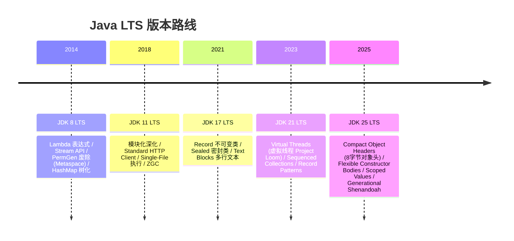

# ☕ Java 总览

这里按 LTS 版本整理 Java 的主要语言、类库与 JVM 变化，涵盖 **JDK 8、JDK 11、JDK 17、JDK 21、JDK 25**。

---

## Java LTS 版本

[完整版本目录](./version/)列出本仓库已收录的版本主题；已有运行基线与镜像证据继续以本页说明为准。

---

## 版本导航

<a href="./version/jdk-8" style="text-decoration: none;">
  

    <h3 style="margin: 0 0 8px 0; color: #fbbf24;">JDK 8 LTS</h3>
    
JEP 126 (Lambda), JEP 107 (Stream), JEP 122 (Metaspace), JEP 180 (HashMap 红黑树树化)。

  

</a>

<a href="./version/jdk-11" style="text-decoration: none;">
  

    <h3 style="margin: 0 0 8px 0; color: #38bdf8;">JDK 11 LTS</h3>
    
JEP 323 (var in Lambda), JEP 321 (HTTP Client), JEP 330 (Single-File), JEP 333 (ZGC)。

  

</a>

<a href="./version/jdk-17" style="text-decoration: none;">
  

    <h3 style="margin: 0 0 8px 0; color: #c084fc;">JDK 17 LTS</h3>
    
JEP 395 (Records), JEP 409 (Sealed Classes), JEP 378 (Text Blocks), JEP 394 (Pattern Matching)。

  

</a>

<a href="./version/jdk-21" style="text-decoration: none;">
  

    <h3 style="margin: 0 0 8px 0; color: #4ade80;">JDK 21 LTS</h3>
    
JEP 444 (Virtual Threads), JEP 431 (Sequenced Collections), JEP 440 (Record Patterns), JEP 439 (Generational ZGC)。

  

</a>

<a href="./version/jdk-25" style="text-decoration: none;">
  

    <h3 style="margin: 0 0 8px 0; color: #f472b6;">JDK 25 LTS</h3>
    
JEP 512 (Instance Main), JEP 513 (Flexible Constructor), JEP 506 (Scoped Values), JEP 519 (Compact Headers), JEP 521 (Generational Shenandoah)。

  

</a>

## 适用边界

适合 JVM 应用与强类型生态；语言级别、JDK 与运行时配置需对应，浏览器容器不提供完整生产部署环境。

## 推荐学习路线

[安装与环境](./install) → [基础语法](./basic) → [数据结构](./data-structures) → [算法](./algorithms) → [完整版本目录](./version/)。先完成最小示例，再阅读版本差异。

## 实验入口与范围

[容器浏览器工作台](/playground/container-java)提供 RISC-V 容器体验，首次使用可能需要较大的运行时下载，先阅读页面资源说明。 [Docker 验证证据](./docker-tooling)展示已有采集结果与缺口。
