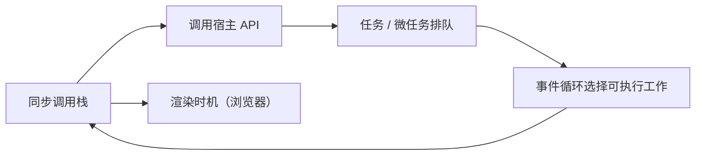

# 🟨 JavaScript 与 Node.js

JavaScript 是以**原型委托、词法闭包、事件循环和动态对象**为核心的语言。浏览器、Node.js 和其他宿主为它提供不同 API；TypeScript 则在 JavaScript 之上增加静态类型分析。

学习 JavaScript 不应按 ES2016、ES2017……逐年背 API。更有效的路线是先理解语言模型，再掌握 ES6 的结构性变化，最后按异步、数据、封装、模块等问题域吸收现代能力。

<VersionDiff
  title="JavaScript 三阶段演进"
  :items="jsVersions"
/>

## ⚡ JavaScript Live DOM 实验室

修改 JavaScript 后切换到“效果”，隔离页面会自动执行 DOM 操作；`console.log`、警告和错误会显示在下方 Console。

<WebLivePlayground
  mode="javascript"
  title="JavaScript DOM + Console Live"
  :initial-code="jsLiveCode"
  :preview-html="jsLiveMarkup"
/>

## 三阶段学习路线

### 1. [ES6 之前：ES1～ES5 经典时代](./pre-es6.md)

理解仍然支配今天代码的底层机制：

- 函数作用域、提升、闭包与 `this` 调用规则
- 原型链与构造函数
- DOM 事件、Ajax、回调与事件循环
- ES5 严格模式、JSON、数组高阶方法
- IIFE、CommonJS、AMD 等模块化前史

### 2. [ES6：现代 JavaScript 奠基](./es6.md)

一次结构性升级，而不是普通年度增量：

- `let` / `const`、解构、Rest / Spread、模板字符串
- 箭头函数、Class、Promise
- Iterator、Generator、Map、Set、Symbol
- ES Modules、Proxy 与 Reflect

### 3. [现代 JavaScript：按能力持续演进](./modern-javascript.md)

把 ES2016 之后的年度更新合并为可应用的能力专题：

- `async` / `await`、Promise 组合与取消协作
- 可选链、空值合并与安全边界数据
- Entries、扁平化、分组和不可变数组
- 私有字段、错误链、异步迭代与现代模块
- 浏览器、Node.js、polyfill 和编译目标的兼容性决策

## 必须分清的四层边界

| 层次 | 负责什么 | 典型内容 |
| :--- | :--- | :--- |
| ECMAScript | 语言语法、类型、执行语义和内建对象 | Closure、Promise、Map、Module、`Array.prototype.toSorted` |
| 浏览器 Web 平台 | 文档、网络、存储、图形和并发宿主能力 | DOM、Fetch、Canvas、Storage、Web Worker |
| Node.js | 服务端运行时与系统接口 | `fs`、`http`、streams、process、CommonJS/ESM 解析 |
| TypeScript | 开发期静态类型系统与编译工具 | 泛型、联合类型、类型缩窄、声明文件 |

因此，`fetch` 不是 ECMAScript 语法，DOM 也不是 JavaScript 语言本身；同一段 JavaScript 能否运行，还取决于宿主和版本。

## 执行模型速览

- 当前调用栈必须先返回，事件循环才会处理后续任务。
- Promise reaction 属于微任务，通常在下一个任务前清空。
- 浏览器在合适时机布局与绘制；Node.js 有自己的事件循环阶段。
- CPU 密集型工作不会因为写成 Promise 自动并行，应考虑 Worker、拆分任务或原生服务。

## Node.js LTS 与语言能力

| Node.js LTS | 核心定位 | 使用建议 |
| :--- | :--- | :--- |
| Node.js 18 | Fetch 与 Web Streams 进入全局，较早的现代服务端基线 | 维护存量项目时确认生命周期 |
| Node.js 20 | 稳定测试运行器、权限模型演进、较新的 V8 | 适合仍要求 Node 20 的工具链 |
| Node.js 22 | 更新 V8、WebSocket 客户端、ESM 互操作继续改善 | 新项目优先结合当前支持周期评估 |

Node LTS 页面保留，是因为运行时版本涉及 V8、系统 API、模块加载和支持周期，不只是某一年增加了两个语法糖。

## 快速入口

- [JavaScript 基础语法](./basic.md)
- [Node.js 18 LTS](./node-18.md)
- [Node.js 20 LTS](./node-20.md)
- [Node.js 22 LTS](./node-22.md)
- [TypeScript 5.x 独立产品文档](/products/typescript/)
